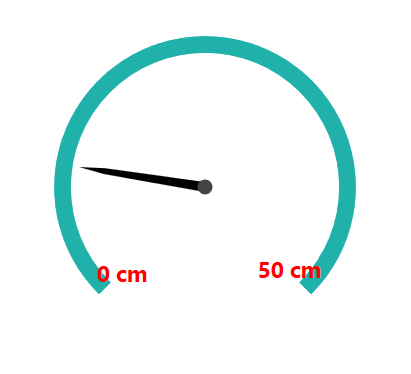
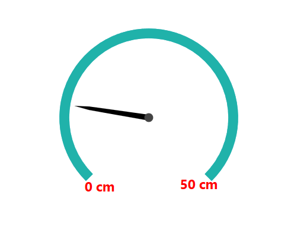

# How to restrict the min, max labels overlapping on the rim in SfCircularGauge in WPF

This demo explains how to restrict the min, max labels overlapping on the rim in SfCircularGauge in WPF.

This article explains how to avoid the min and max labels overlapping on rim in the Syncfusion WPF SfCircularGauge as shown in the following image.



This can be resolved by adjusting the margin of custom circular scale along with follow the below steps

Step 1: Initialize the SfCircularGauge control with adding the needed range and pointers. 

Step 2: Add a custom CircularScale control  to SfCircularGauge since we don’t have a direct support to adjust CircularPanel Margin to avoid the overlapping. It has been achieved by overriding the OnApplyTemplate method of extended CircularScale.

[C#]

```
public class CircularScaleExt : CircularScale
    {
        public override void OnApplyTemplate()
        {
            base.OnApplyTemplate();
            var panel = GetTemplateChild("LabelsPanel") as CircularPanel;
            if (panel != null)
                panel.Margin = new Thickness(0, 20, 0, 0);
        }
    }
```
Step 3:  Customize its appearance by adding the required properties like StartValue, EndValue of Range and LabelStroke, FontSize, FontWeight for CircularScale

[XAML]

```
<syncfusion:SfCircularGauge Width="200"   GaugeType="North">
        <syncfusion:SfCircularGauge.Scales>
            <!--Extended circular scale-->
            <local:CircularScaleExt LabelStroke="Red" 
                                      LabelPostfix="cm"
                                      ShowLabels="True" 
                                      FontSize="15"
                                      FontWeight="Bold"
                                      StartValue="0" 
                                      EndValue="50" 
                                      TickStroke="Transparent" 
                                      LabelPosition="Custom"  
                                      Interval="50" >
                <syncfusion:CircularScale.Ranges>
                    <syncfusion:CircularRange  StartValue="0"  Stroke="LightSeaGreen" Offset = "0.3" 
                                                 StrokeThickness="20" EndValue="50"   StartWidth="0" EndWidth="50"/>
                </syncfusion:CircularScale.Ranges>
                <syncfusion:CircularScale.Pointers>
                    <syncfusion:CircularPointer 
                                                    PointerType="NeedlePointer" 
                                                    NeedlePointerType="Tapered"
                                                    NeedlePointerStroke="Black"
                                                    PointerCapStroke="Black"
                                                    NeedlePointerVisibility="Visible" 
                                                    NeedleLengthFactor="0.85"
                                                    Value="10"
                                                    EnableAnimation="True"                                                    
                                                    />
                </syncfusion:CircularScale.Pointers>
            </local:CircularScaleExt>
        </syncfusion:SfCircularGauge.Scales>
    </syncfusion:SfCircularGauge>
```


## See also

[How do I set the start and end values for the scale](https://help.syncfusion.com/wpf/radial-gauge/scales#setting-start-and-end-values-for-scale)
 
[How do I customize the position of rim](https://help.syncfusion.com/wpf/radial-gauge/rim#setting-a-position-for-rim)
 
[How do I add a needle pointer to the gauge](https://help.syncfusion.com/wpf/radial-gauge/pointers#needle-pointer)
 
[How to change the position of ticks](https://help.syncfusion.com/wpf/radial-gauge/ticks#setting-ticks-visibility-in-scale)


